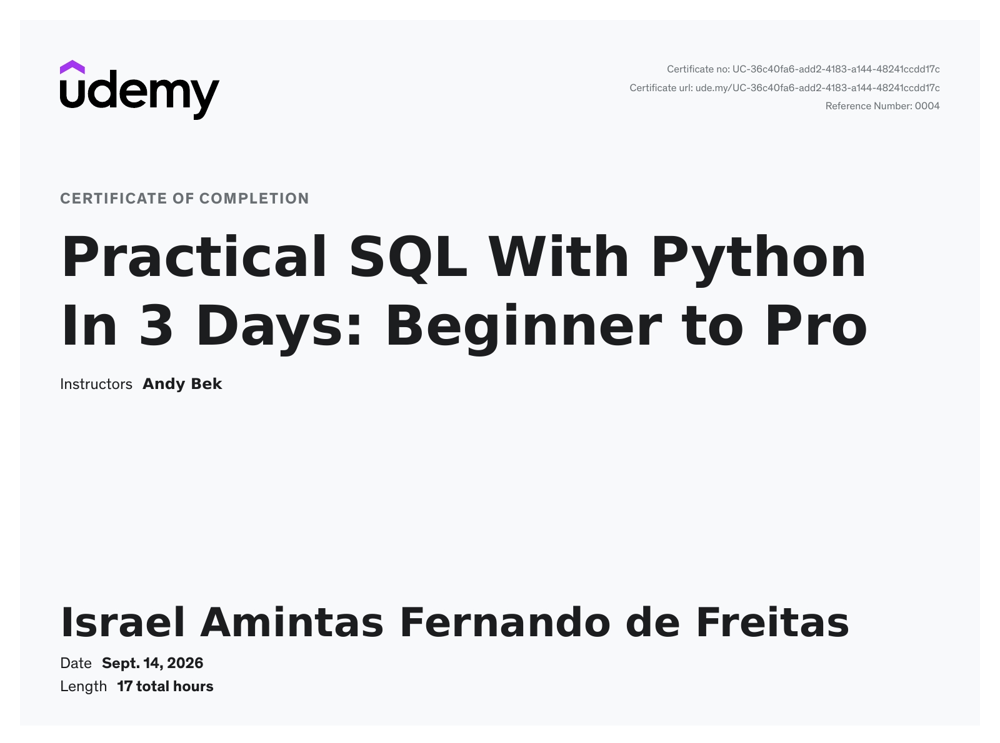

# Curso da Udemy: [Practical SQL With Python In 3 Days: Beginner to Pro](https://www.udemy.com/course/practical-sql-with-python-in-3-days/?couponCode=MT260907G1B)

## Projetos
- Freight Manager — SQLite
- Course Registrar — MySQL
- Guestbook API — PostgreSQL + FastAPI

## Progresso
- [X] Day 0 - Two Minute Welcome
- [x] Day 1 - Freight Manager
- [x] Day 2 - Course Registrar
- [x] Day 3 - Guestbook API
- [x] Thank you

## Tecnologias
Python, SQL, SQLite, MySQL, PostgreSQL, FastAPI, RAILWaY, virtual environments, SQL injection, prepared statements, dynamic SQL, virtual environments, SQL injection, prepared statements, dynamic SQL, virtual environments, SQL injection

## Conceitos
DBAPI 2.0, connections, cursors, transactions, parameterized statements, SQL injection, prepared statements, dynamic SQL, virtual environments

## Observações

